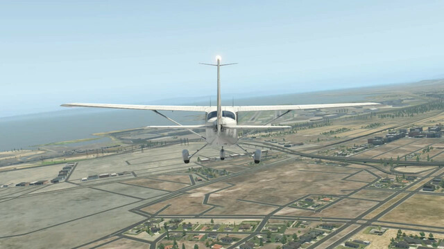

<p align="center">
  
</p>

# Vision Network for State Estimation in X-Plane 11

## Installation

```bash
$ git clone https://github.com/rdyro/xplane_vision_network
$ cd xplane_vision_network
$ git lfs pull # to download the trained resnet model
```

## Quickstart

Check out: `notebooks/analyzed_trained_networks.ipynb`

## Dataset

`https://storage.googleapis.com/rdyro_temp/xplane_all/*`

> Use `gsutil`
